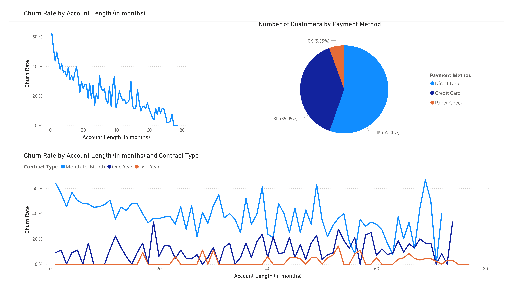

# 📉 Customer Churn Analysis in Power BI

This project analyzes customer churn data from a fictional telecom company, **Databel**, using **Power BI**. It was developed as part of a real-world case study offered by **DataCamp** and covers everything from data modeling to dashboard design.

## 🎯 Objective

To identify patterns and causes of customer churn and propose strategies to reduce it. The final result is a set of interactive dashboards built with DAX, calculated columns, and advanced Power BI visualizations.

## 🛠️ Tools & Technologies

- Power BI Desktop
- DAX (Data Analysis Expressions)
- Power Query
- DataCamp Learning Platform

## 📁 Project Structure

| Folder       | Description |
|--------------|-------------|
| `report/`    | Power BI report files (`.pbix`) |
| `images/`    | Dashboard previews |
| `docs/`      | Project documentation and write-up |
| `scripts/`   | Key DAX formulas and calculations |

## 🔍 Key Insights
- Customers on monthly contracts have the highest churn rates.
- Younger and older customers show different churn behaviors.
- High data usage does not always correlate with retention.

## 📊 Dashboards

- **Dashboard 1:** Churn by contract type, plan, and internet service
- **Dashboard 2:** Demographics, age brackets, geolocation, and plan-based churn

### 📸 Previews

## ✅ How to Run
Open `.pbix` files using Power BI Desktop.

## 📄 License
MIT License
